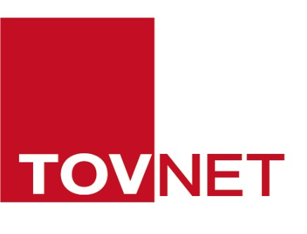
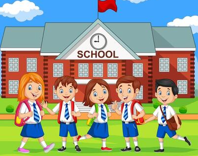

<h1 align="center">Hoyong Yang | Development Portfolio</h1>

  Web Systems · Field R&D · AI/NLP · Vision AI · Network Infrastructure · Data Analysis

  
  
  

---

## About Me

실제 업무와 프로젝트에서 발생한 문제를 **코드, 데이터, 문서, 발표자료**로 정리하는 개발 지향 포트폴리오입니다.

웹 업무 시스템, AI/NLP, Vision AI, CCTV 네트워크, 산업 데이터 분석 경험을 중심으로 정리하고 있습니다.  
단순 결과물보다 **맡은 역할, 문제 해결 과정, 사용 기술, 결과물**이 함께 보이도록 구성했습니다.

---

## Portfolio Map

| Work Portfolio | School Projects | Competition |
| --- | --- | --- |
|  |  |  |
| **[TOVNET](https://github.com/yongnyong/tovnet)**  현장 업무 기반 R&D 및 개발 포트폴리오 | **[School-Projects](https://github.com/yongnyong/School-Projects)**  학교 팀 프로젝트 및 코드 기반 과제 모음 | **[competition-yong](https://github.com/yongnyong/competition-yong)**  대회, 수상, 대외활동 기록 |
| `PHP` `Laravel` `MySQL` `CCTV` `RTSP` `Vision AI` | `Python` `NLP` `Data Analysis` `Network` `ML` | `Awards` `Portfolio` `Activities` `HTML` |

---

## TOVNET Work Portfolio

  

[tovnet](https://github.com/yongnyong/tovnet)는 실제 업무에서 수행한 개발, R&D 분석, 현장 네트워크 운영 경험을 정리한 저장소입니다.

| Project | What I Worked On | Keywords |
| --- | --- | --- |
| [MES 업무관리 플랫폼](https://github.com/yongnyong/tovnet/tree/main/mes-portfolio) | 제조, 재고, 업무공유, 고객 A/S를 통합 관리하는 PHP 기반 사내 웹 시스템 | `PHP` `MySQL` `JavaScript` `Bootstrap` |
| [TOVNET-SEG](https://github.com/yongnyong/tovnet/tree/main/tovnet-seg-portfolio) | CCTV 기반 수면 조류 Segmentation AI 시스템의 기술 인수 및 운영 구조 분석 | `Python` `PyTorch` `OneFormer` `RTSP` |
| [탄천 CCTV Network](https://github.com/yongnyong/tovnet/tree/main/tancheon-cctv-network-portfolio/tancheon-cctv-network-portfolio) | CCTV 원격 모니터링 환경 구축 및 네트워크 장애 원인 분석 | `RTSP` `NAT` `DHCP` `Omada` |
| [USIM Management](https://github.com/yongnyong/tovnet/tree/main/usim-management-portfolio) | 엑셀 기반 USIM 관리 업무를 DB 기반 웹 시스템으로 전환 | `Laravel` `PHP` `MySQL` `Excel` |

---

## School Projects

| Project | Preview | Summary |
| --- | --- | --- |
| [5G to 6G Network Evolution](https://github.com/yongnyong/School-Projects/tree/main/network-evolution-portfolio) |  | 5G/6G 기술 비교, 핵심 기술, 산업 적용 사례를 정리한 네트워크 연구 프로젝트 |
| [Ford Engine Fault Detection](https://github.com/yongnyong/School-Projects/tree/main/ford-engine-timeseries-portfolio) |  | 엔진 센서 시계열 데이터를 활용한 이상 탐지 및 머신러닝 모델 비교 |
| [Pronunciation-Based Japanese Translator](https://github.com/yongnyong/School-Projects/tree/main/japanese-pronunciation-translator) |  | 발음 기반 입력을 활용한 일본어 번역 모델과 서비스 화면 설계 |
| [Korean Toxic Comment Filter](https://github.com/yongnyong/School-Projects/tree/main/korean-toxic-comment-filter-clean) | `NLP` `BERT` `KoELECTRA` | 한국어 악성 댓글 및 혐오 표현 탐지를 위한 BERT 계열 텍스트 분류 실험 |

---

## Competition & Activities

  

[competition-yong](https://github.com/yongnyong/competition-yong)는 대회 참가, 수상 경험, 대외활동 포트폴리오를 정리하는 저장소입니다.

| Item | Summary |
| --- | --- |
| NYPC Portfolio | NYPC 지원 및 대회 활동을 위해 제작한 웹 포트폴리오 |
| Debate Award Portfolio | 제12회 가톨릭대학생 토론대회 대상 수상 경험 정리 |

---

## Tech Stack

| Area | Stack |
| --- | --- |
| Web / Backend | `PHP` `Laravel` `MySQL` `MariaDB` `JavaScript` `Bootstrap` `Blade` |
| AI / NLP / Data | `Python` `PyTorch` `Hugging Face Transformers` `BERT` `KoELECTRA` `Seq2Seq` `Pandas` `Scikit-learn` |
| Vision / Network / Field | `RTSP` `CCTV` `NAT` `Port Forwarding` `DHCP` `Omada` `FFmpeg` `Semantic Segmentation` |
| Tools | `Git` `GitHub` `PyCharm` `Excel` `PowerPoint` `Markdown` |

---

## GitHub Stats

  
  

---

## Current Direction

- 실무에서 수행한 업무를 포트폴리오 형태로 구조화
- 현장 문제 해결 과정을 코드와 문서로 함께 기록
- AI/NLP, Vision AI, 네트워크, 웹 시스템 개발 경험을 연결
- 프로젝트별 README 품질 개선 및 GitHub 프로필 정리
